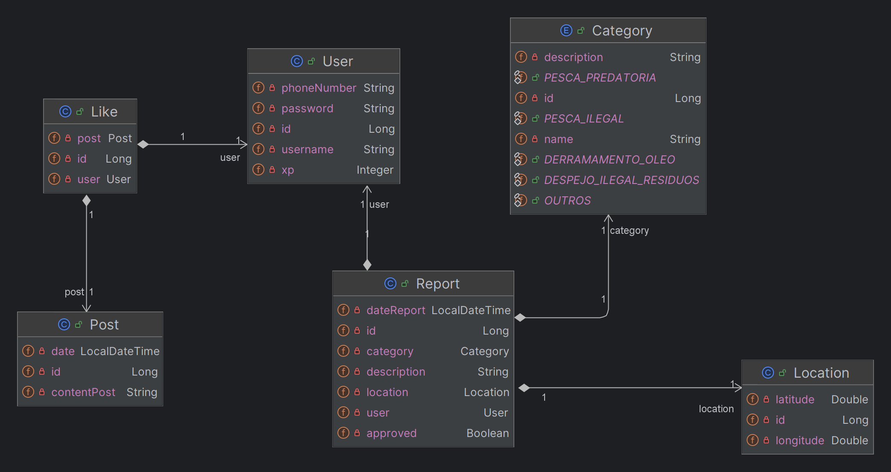
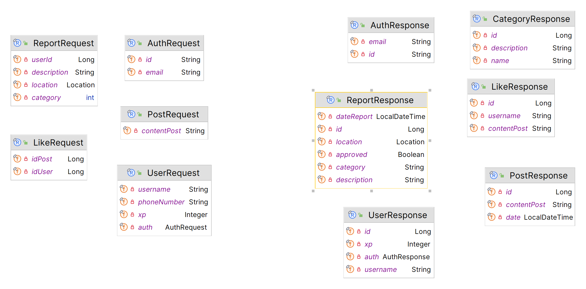
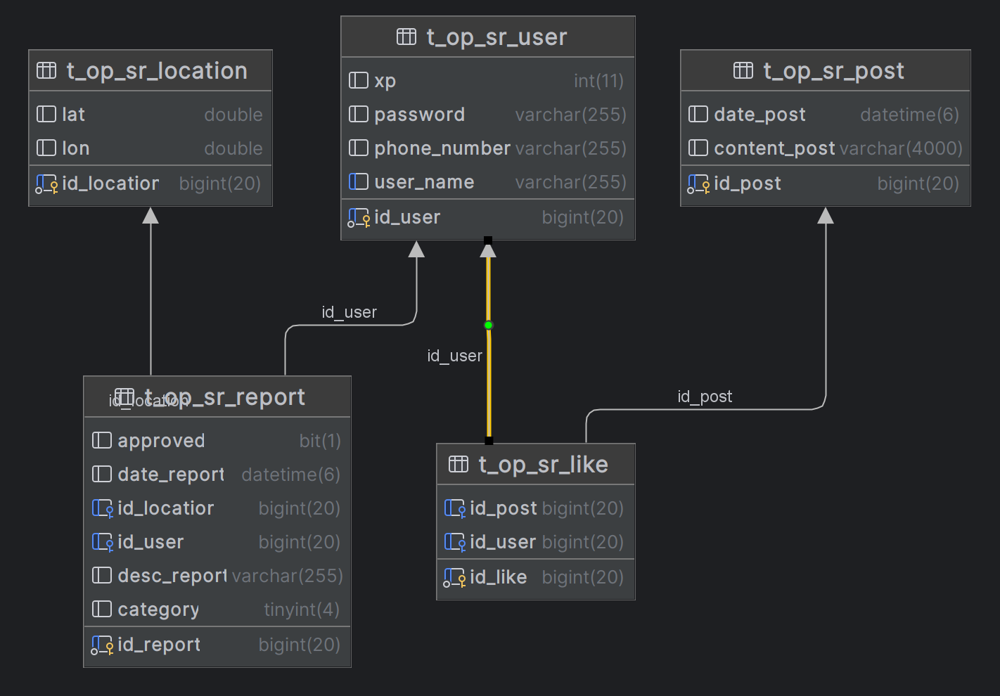

# SeaReportAPI

| INTEGRANTES                    | RM      | 
|--------------------------------|---------|
| Amanda Bomfim De Oliveira      | RM99741 |
| Cauã Alencar Rojas Romero      | RM98638 |   
| Jaci Teixeira Santos           | RM99627 | 
| Leonardo dos Santos Guerra     | RM99738 | 
| Maria Eduarda Ferreira da Mata | RM99004 | 

## LINK DO REPOSITORIO NO GITHUB
[Link](https://github.com/jaciteixeira/SeaReport)

## LINK VÍDEO APRESENTAÇÃO DA APLICAÇÃO
[Apresentação](https://www.youtube.com/watch?v=zx-qg7fIDNw)

## LINK VÍDEO APRESENTAÇÃO DA APLICAÇÃO
[Pitch](https://https://youtu.be/1HrC5YvKA5w?si=kqm5lwFNbCshT8Kx)

## SUMÁRIO

[ RESUMO ](#_RESUMO)

[ DIAGRAMAS ](##_DIAGRAMA DE CLASSES)

[ INSTRUÇÕES PARA IMPORTAR ](##_INSTRUÇÕES_PARA_IMPORTAR)

[ ENDPOINTS DA API ](##_ENDPOINTS_DA_API)

## RESUMO

Denunciar crimes no mar, como pesca ilegal e pirataria, é complicado. Atualmente, isso requer um celular com sinal, conhecimento da entidade responsável pela região, contato durante horários de atendimento e precisão na localização, o que desmotiva muitas pessoas a denunciar.

Para resolver isso, criamos a Sea Report, uma plataforma de denúncia de crimes no mar e áreas costeiras. Após baixar o aplicativo e criar uma conta, você acessa "notas da comunidade" com informações sobre crimes e previsões geradas por um algoritmo de machine learning. As denúncias podem ser feitas offline e são enviadas automaticamente quando o dispositivo se conecta à internet, direcionadas às autoridades competentes com base na localização. Isso facilita o processo de denúncia e encoraja mais pessoas a reportar crimes no mar.

## DIAGRAMA DE CLASSES

## DIAGRAMA REQUEST/RESPONSE

## DIAGRAMA DER

## INSTRUÇÕES PARA IMPORTAR

### Importar Testes no Postman

Para importar testes no Postman, siga estas etapas:

1. Abra o Postman: Inicie o aplicativo Postman no seu computador.
2. Acesse a aba "Collections": Clique na aba "Collections" no painel esquerdo do Postman.
3. Clique em "Import": Na parte superior do painel "Collections", clique no botão "Import".
4. Selecione o arquivo: Na janela de importação que aparece, clique em "Upload Files" e selecione o arquivo contendo os testes que você deseja importar. Certifique-se de que o arquivo esteja no formato adequado para importação no Postman, como um arquivo JSON ou uma coleção Postman.
5. Confirme a importação: Depois de selecionar o arquivo, clique em "Import" para confirmar e importar os testes.
6. Acesse os testes importados: Após a importação ser concluída com sucesso, você poderá encontrar os testes importados na coleção correspondente no painel esquerdo do Postman, dentro da aba "Collections".

### Clonar e Executar um Projeto no IntelliJ IDEA

Este guia fornece instruções passo a passo sobre como clonar e executar um projeto no IntelliJ IDEA.

#### Clonar o Repositório Git

1. Abra o IntelliJ IDEA.
2. Clique em "Get from Version Control" na tela inicial ou vá em "VCS" > "Get from Version Control" no menu.
3. Na janela "Get from Version Control", cole o URL do repositório Git que você deseja clonar.
4. Escolha o diretório onde deseja clonar o repositório.
5. Clique em "Clone".

#### Importar o Projeto

1. Quando o IntelliJ terminar de clonar o repositório, ele deve detectar automaticamente o tipo de projeto e abrir uma janela de importação.
2. Selecione "Import project" na janela de importação.
3. Escolha a opção "Import project from external model" e selecione "Maven" ou "Gradle", dependendo do tipo de projeto que está sendo importado.
4. Clique em "Next".
5. Selecione as configurações de importação adequadas e clique em "Next" novamente.
6. Clique em "Finish" para concluir a importação do projeto.

#### Executar o Projeto

1. Após importar o projeto, localize o arquivo de configuração principal do seu aplicativo, como uma classe com um método `main`.
2. Clique com o botão direito do mouse no arquivo de configuração e escolha "Run <nome do arquivo>" para executar o aplicativo.

## ENDPOINTS DA API
1. ### USUÁRIO
    1. #### `GET /user`

       Obter todos os usuários.

       Parâmetros de consulta:
        - `username` (opcional): Filtrar usuários pelo nome de usuário.

    2. #### `POST /user`

       Criar um novo usuário.

       Corpo da requisição:
       ~~~json
       {
        "username":"joao_silva",
        "phoneNumber":"+5511987654321",
        "xp": 0
        "auth": {
          "id": "yO8WwMFkN5Za9zZ6jncW7zxlJTh1",
          "email": "joao_silva@gmail.com"
        }
       }
       ~~~

    3. #### `POST /user/auth`

       Efetuar login de usuário.

       Corpo da requisição:
       ~~~json
       {
        "id": "yO8WwMFkN5Za9zZ6jncW7zxlJTh1",
        "email": "joao_silva@gmail.com"
       }
       ~~~

2. ### RELATÓRIO
    1. #### `POST /report`

       Salvar um novo relatório.

       Corpo da requisição:
       ~~~json
       {
       "description":"Denuncia de incidente de derramamento de óleo",
       "userId": 1,
       "category": 2,
       "location":{
           "longitude": -17.950722,
           "latitude": -38.718196
           }
       }
       ~~~

    2. #### `GET /report/user/{userId}`

       Obter relatórios por ID de usuário.

    3. #### `GET /report/disapproved`

       Obter relatórios reprovados.

    4. #### `GET /report/category`

       Obter categorias de relatórios.
   
   5. #### `GET /report/approve-report/{id}`
   
        Aprovar os relatórios.

3. ### POSTAGEM
    1. #### `POST /post`

       Salvar uma nova postagem.

       Corpo da requisição:
       ~~~json
       {
       "contentPost": "Os mares desempenham um papel crucial em sustentar a vida na Terra, fornecendo alimentos, regulando o clima e gerando oxigênio. No entanto, a saúde dos nossos oceanos está sob crescente ameaça devido à poluição, pesca excessiva, acidificação e mudanças climáticas. Preservar os mares é essencial para garantir a sobrevivência não apenas das espécies marinhas, mas também da humanidade. Ações individuais, como reduzir o uso de plásticos descartáveis, apoiar práticas de pesca sustentável e promover a conservação marinha, são cruciais para proteger e restaurar a saúde dos nossos preciosos ecossistemas marinhos."
       }
       ~~~

    2. #### `GET /post`

       Obter todas as postagens.

       Parâmetros de consulta:
        - `word` (opcional): Filtrar postagens por palavra-chave.

4. ### LIKE
    1. #### `POST /likes`

       Salvar um novo like.

       Corpo da requisição:
       ~~~json
       {
       "idUser": 1,
       "idPost": 1
       }
       ~~~

    2. #### `GET /user/{userId}/post/{postId}`

       Obter likes por ID de usuário e ID da postagem.

    3. #### `DELETE /likes/{id}`

       Excluir um like pelo seu ID.
